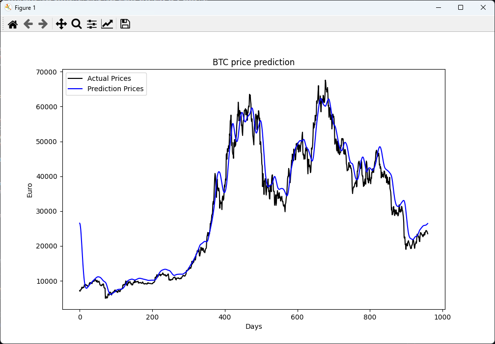
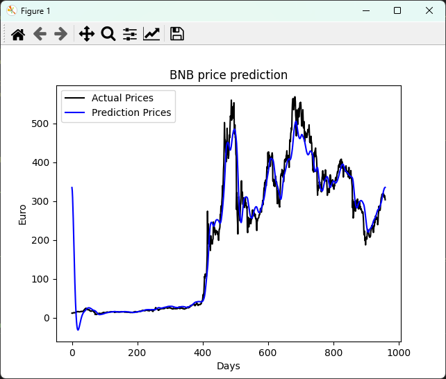

<h3 align="center">Python Crypto Currency Prediction</h3>

Crypto price prediction with tensorflow built with python displayed on a graph

### Screenshots

  
  

#### Warning
This is not to be used in a commercial enviroment, it was written for fun an to see the capabilities on a prediction model built with tensorflow on python 

#### How to use
- It is very easy! Install the required modules using pip, add in the crypto symbol you would like to use eg. BTC, ETH, LTC, BCH, or XLM etc. Enter the currency you would like to compare it to eg. USD, EUR, GBP etc.
- Next set the ammount of days that the prediction model can look into the past and then set the days into the future the model can predict the price of the crypto
- Lastly you can adjust the number of epochs on line 54, this will greatly improve the potential accurancy, however this increases the amount of time need to process the data.
**This does not use GPU acceleration it only uses CPU, it would be much faster if it was written to take advantage of the 

#### Contributing
If you have any idea how to make this app better, please [create a pull request](https://github.com/JaredWestley/Python-Crypto-Currency-Prediction/compare). If you find any bug, please [create an issue](https://github.com/JaredWestley/Python-Crypto-Currency-Prediction/issues/new).

#### License
This project is licensed under an MIT license. Please check [LICENSE](LICENSE).
